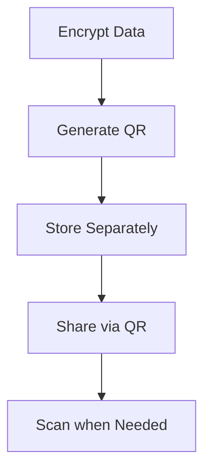

# 🔐 Secure Vault Pro (QR Code Edition)

**Military-Grade Data Protection using Python & Streamlit**  
Now with QR Code Integration for Hybrid Digital-Physical Security

---


## 🌟 Enhanced Features

### 🔳 QR Code Integration
- **QR Code Generation**: Automatically create QR codes for encrypted data.
- **QR Scanning**: Decrypt data by scanning QR codes from images.
- **Mobile-Friendly**: Easily transfer encrypted data between devices.
- **Error Correction**: Built-in L-level error correction for damaged codes.
- **Visual Verification**: Quickly identify encrypted data via QR codes.

---

## 🚀 Getting Started (Updated)

### 🧩 Installation

Install the necessary dependencies:

```bash
# New dependencies for QR handling
pip install opencv-python qrcode
```

---

## 🧭 Navigation Guide Updates

### 🔐 Store Data (QR Additions)
- Generates QR code with encrypted data
- Download QR as PNG for offline storage
- Visual confirmation of encryption success

#### New Options:
- ✅ **Download QR Code** button
- ✅ **Preview of generated QR code**
- ✅ **Error-corrected QR versions**

---

### 🔓 Retrieve Data (QR Features)
- Upload QR code images (PNG/JPG) for decryption
- Drag-and-drop QR code support
- Mobile camera scanning support (via image upload)

#### New Flow:
1. Choose between **text input** or **QR upload**
2. Scan/upload QR code
3. Automatic decryption initiation

---

## 🔒 Enhanced Security Features

### 🛡️ QR Security Measures
- **Static QR Codes**: No phoning home – all data contained in code
- **Tamper Evidence**: Visual distortion detection
- **Size Optimization**: Auto-adjusts QR version to data size
- **Secure Deletion**: No QR data remains in temp files

---

## 💡 New Best Practices

### 📌 QR Code Handling
- Print important QR codes for physical backup
- Store QR codes separately from passkeys
- Use password-protected ZIP files when emailing QR codes
- Prefer QR codes for large encrypted data (>500 characters)

---

## 🛠️ Technical Details (QR Additions)

### ⚙️ QR Implementation

#### Generation:
- Library: `qrcode`
- **Error Correction**: L Level (7% recovery)
- **Optimal version detection**: QR Versions 1–40
- **Customization**: Adjustable size and color

#### Scanning:
- Library: `OpenCV`
- Supports rotated/damaged QR codes
- Detects multiple codes in one image
- Corrects EXIF orientation

### 📁 File Support
- **Input Formats**: PNG, JPG, JPEG
- **Output Format**: PNG (300dpi)
- **Max Size**: 4096x4096 pixels

---

## 🎥 Updated Demo Walkthrough

### ✅ Storing Data with QR
- Download QR code alongside encrypted text
- Optional: Print QR code for physical storage

### 🔓 Retrieving via QR
1. Go to **Retrieve Data**
2. Click **Upload QR Code**
3. Select image from device
4. Encrypted data auto-populates
5. Enter passkey to decrypt

---

## 🔁 QR Workflow Diagram



---

## ❓ Updated FAQ

**Q: How secure are QR codes compared to text?**  
A: Equally secure – they contain the same encrypted data in visual format.

**Q: What QR code sizes are supported?**  
A: Any size from 2x2 cm to poster-sized prints. Minimum 300px resolution recommended.

**Q: Can I edit encrypted QR codes?**  
A: Any modification will break the code. Use error correction for minor damage.

**Q: How many characters can a QR store?**  
A: Version 40 QR codes can store up to 2953 bytes – perfect for most encrypted data.

**Q: QR scanning not working?**  
A: Ensure:
- Adequate lighting
- Flat, non-reflective surface
- Complete code visible in image
- Minimum 50px margin around code

---

## 🔐 This Update Transforms Secure Vault Pro

A hybrid digital-physical security solution – combining modern encryption with practical QR code functionality for real-world use cases.
